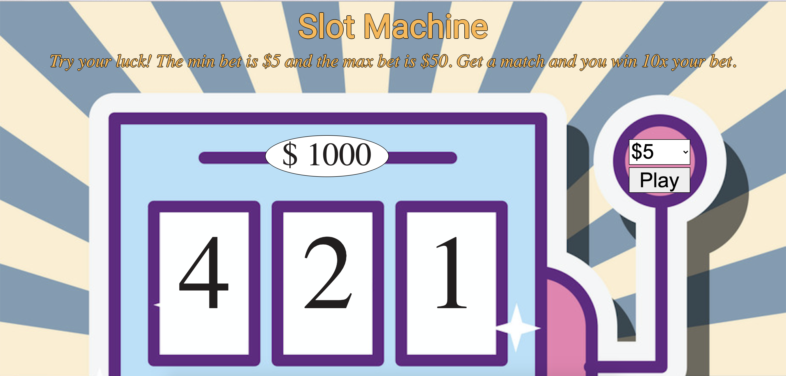

# Slot Machine
A simple slot machine with 3 reels, 5 items per reel, a bank, and five bet options.

**View project in browser:** https://dfdev-slotmachine.netlify.app/

## Design and Development:
**Skills Used** HTML, CSS, JavaScript
I built this slot machine by breaking down its components and pseudo-coding what they would do. Doing so made it easier to translate into functions in JavaScript.

## Lessons Learned
In the beginning I started writing in JS by what I knew and after laying down the bulk of the foundation, I was able to optimize to achieve cleaner code. 
